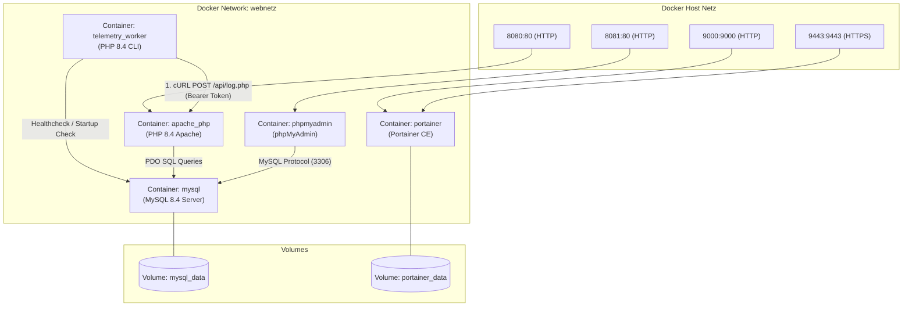
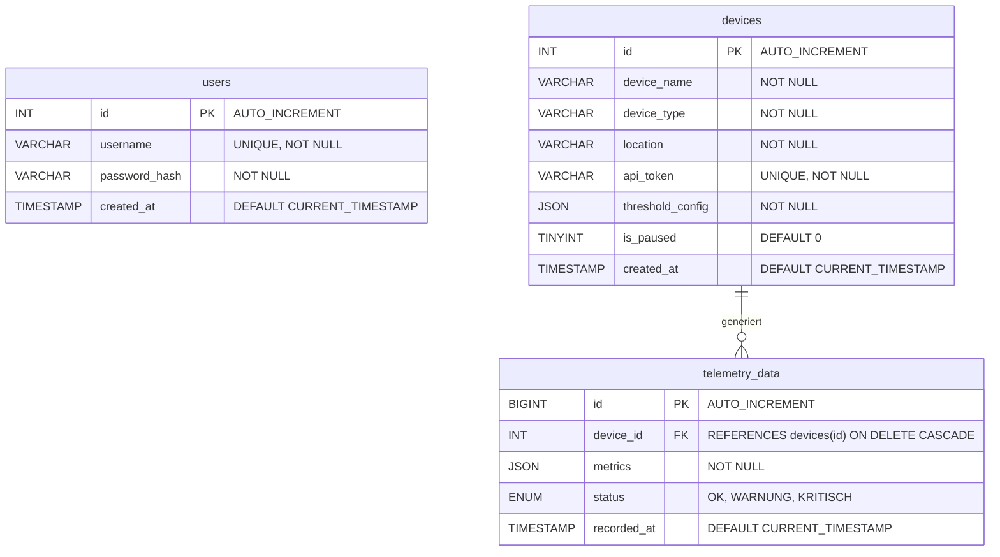
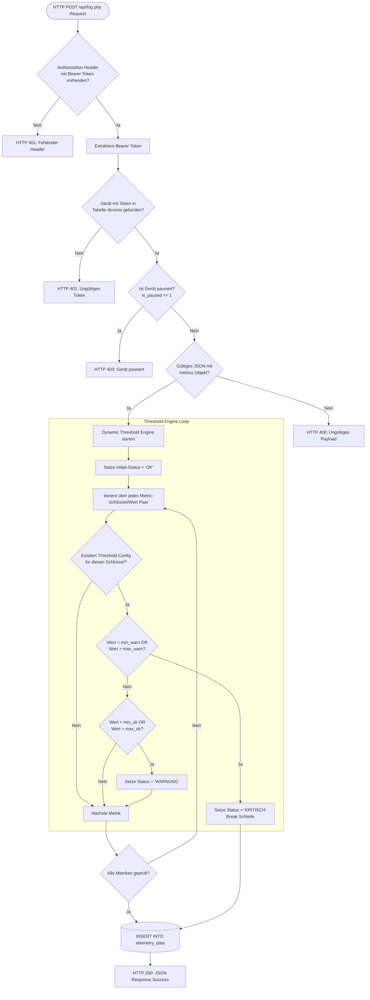
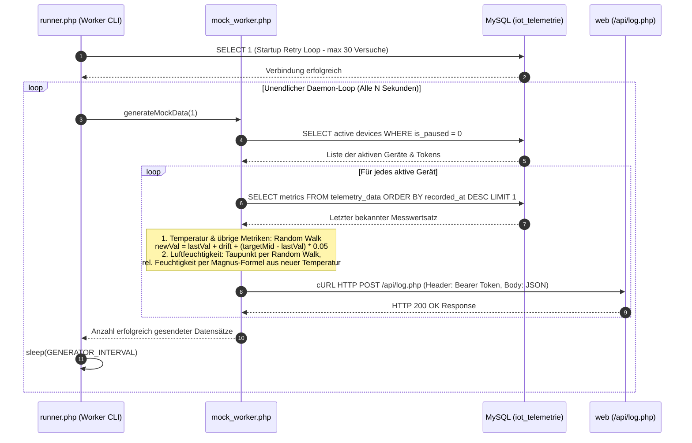

# IoT Telemetrie Simulator & Dashboard (Modul 347)

Eine vollumfängliche, dockerisierte End-to-End-Lösung zur Echtzeit-Erfassung, automatisierten Auswertung, Simulation und Visualisierung von IoT-Telemetriedaten.

Das Projekt entstand im Rahmen des ICT Moduls 347 ("Dienste mit Containern isolieren") und demonstriert die Microservice-Orchestrierung mittels Docker Compose, eine flexible PHP 8.4 REST-API mit dynamischer Schwellenwert-Engine, einen realistischen Telemetrie-Simulations-Worker auf Basis von Random-Walk-Algorithmen sowie ein modernes, interaktives Dashboard.

## Inhaltsverzeichnis

- [IoT Telemetrie Simulator \& Dashboard (Modul 347)](#iot-telemetrie-simulator--dashboard-modul-347)
  - [Inhaltsverzeichnis](#inhaltsverzeichnis)
  - [Projekt-Übersicht \& Kernfunktionen](#projekt-übersicht--kernfunktionen)
    - [Hauptmerkmale:](#hauptmerkmale)
  - [Systemarchitektur \& Container-Orchestrierung](#systemarchitektur--container-orchestrierung)
    - [Container-Spezifikationen](#container-spezifikationen)
    - [Volume \& Netzwerk-Konfiguration](#volume--netzwerk-konfiguration)
  - [Projekt- und Dateistruktur](#projekt--und-dateistruktur)
  - [Datenbankmodell \& Schema (ERD)](#datenbankmodell--schema-erd)
    - [Tabellenspezifikationen](#tabellenspezifikationen)
      - [1. `users`](#1-users)
      - [2. `devices`](#2-devices)
      - [3. `telemetry_data`](#3-telemetry_data)
  - [Telemetrie-Ingestion \& Dynamic Threshold Engine](#telemetrie-ingestion--dynamic-threshold-engine)
    - [Logik-Matrix der Statusbewertung:](#logik-matrix-der-statusbewertung)
  - [Background Worker \& Simulations-Algorithmus](#background-worker--simulations-algorithmus)
    - [Der Random-Walk-Formelansatz](#der-random-walk-formelansatz)
    - [Physikalische Kopplung: Temperatur und Luftfeuchtigkeit](#physikalische-kopplung-temperatur-und-luftfeuchtigkeit)
  - [REST-API Spezifikation](#rest-api-spezifikation)
    - [1. Telemetrie Ingestion Endpoint](#1-telemetrie-ingestion-endpoint)
      - [Request Payload Beispiel:](#request-payload-beispiel)
      - [Response Beispiel (200 OK):](#response-beispiel-200-ok)
      - [Fehler-Antworten:](#fehler-antworten)
    - [2. Dashboard Data Fetching Endpoint](#2-dashboard-data-fetching-endpoint)
      - [Response Beispiel (200 OK):](#response-beispiel-200-ok-1)
  - [Web-Dashboard \& Administrative Funktionen](#web-dashboard--administrative-funktionen)
    - [Key UI Features:](#key-ui-features)
  - [Sicherheitskonzept \& Authentifizierung](#sicherheitskonzept--authentifizierung)
  - [Quick Start \& Setup-Anleitung](#quick-start--setup-anleitung)
    - [Voraussetzungen](#voraussetzungen)
    - [Step-by-Step Inbetriebnahme](#step-by-step-inbetriebnahme)
    - [Code-Änderungen übernehmen \& Datenbank zurücksetzen](#code-änderungen-übernehmen--datenbank-zurücksetzen)
  - [Service-Übersicht \& Zugangsdaten](#service-übersicht--zugangsdaten)
  - [Projektteam](#projektteam)

## Projekt-Übersicht & Kernfunktionen

Das IoT-Telemetrie-System wurde entwickelt, um eine vollständige Infrastruktur für IoT-Geräte bereitzustellen. Da in Testumgebungen oft keine physikalische Sensor-Hardware zur Verfügung steht, enthält das System einen eigenständigen Simulationsservice, der realistisch schwankende Messwerte generiert und per REST-API einspeist. Vorkonfiguriert sind Temperatur, Luftfeuchtigkeit und Spannung; über das Admin-Panel lassen sich beliebige weitere Metriken (z. B. CO2) anlegen.

### Hauptmerkmale:

- **Multi-Container Microservice Architektur:** Vollständig isolierte Services für Webserver, Worker, Datenbank, phpMyAdmin und Portainer über Docker Compose.
- **Dynamische Schwellenwert-Engine:** Jedes IoT-Gerät kann individuelle Schwellenwerte für beliebige Metriken definieren. Eingehende Messdaten werden serverseitig in Millisekunden analysiert und mit einem Status (`OK`, `WARNUNG`, `KRITISCH`) klassifiziert.
- **Realistische Datensimulation:** Der Hintergrund-Worker simuliert physisches Trägheitsverhalten von Sensoren mittels kontrolliertem _Random-Walk_ inklusive Tendenz zur Mitte. Die Luftfeuchtigkeit wird physikalisch korrekt aus Temperatur und Taupunkt berechnet (Magnus-Formel): wird es wärmer, sinkt die relative Feuchtigkeit – wie in einem echten Raum.
- **Interaktives Dashboard:** Live-Charts (Chart.js) mit automatischem Intervall-Polling, Multi-Kriterien-Filterung, Suche und Seitennavigation.
- **Sensor-Steuerung:** Pause- und Reaktivierungsfunktion für einzelne Sensoren, Token-Reset, individuelle Detailseiten sowie CSV-Datenexport.
- **Sichere API:** Token-basierte Bearer-Authentifizierung für den Ingestion-Endpoint.

## Systemarchitektur & Container-Orchestrierung

Das Gesamtsystem basiert auf Docker und verteilt die Aufgaben auf fünf spezialisierte Container, die über ein gemeinsames, isoliertes Bridge-Netzwerk (`webnetz`) miteinander kommunizieren.



### Container-Spezifikationen

| Container Name     | Service Name | Basis-Image                     | Zugewiesener Port        | Zweck / Funktion                                                                    |
| ------------------ | ------------ | ------------------------------- | ------------------------ | ----------------------------------------------------------------------------------- |
| `apache_php`       | `web`        | `php:8.4-apache` (Custom Build) | `8080:80`                | Stellt das Web-Dashboard, das Admin-Panel und die HTTP REST-APIs bereit.            |
| `telemetry_worker` | `worker`     | `php:8.4-apache` (Custom Build) | Intern                   | Führt dauerhaft den Background-Cron-Loop (`runner.php`) aus und simuliert Sensoren. |
| `mysql`            | `mysql`      | `mysql:8.4`                     | `3306` (Intern)          | Relationale Hauptdatenbank für Benutzer, Sensor-Metadaten und Telemetrielogs.       |
| `phpmyadmin`       | `phpmyadmin` | `phpmyadmin:latest`             | `8081:80`                | Webbasierte Benutzeroberfläche zur Datenbankverwaltung.                             |
| `portainer`        | `portainer`  | `portainer/portainer-ce:latest` | `9000:9000`, `9443:9443` | Management-Oberfläche zur Überwachung der Docker-Container.                         |

### Volume & Netzwerk-Konfiguration

- **`webnetz`**: Ein benutzerdefiniertes Docker-Bridge-Netzwerk, das allen Containern die aufgelöste Namenskommunikation ermöglicht (z. B. greift der Worker unter `http://web/api/log.php` auf den Webserver zu).
- **`mysql_data`**: Persistentes Named Volume für die Datenbanktabellen.
- **`portainer_data`**: Persistentes Volume für die Konfiguration und Logins von Portainer.
- **Auto-Init**: Die Schema-Datei `./www/schema.sql` ist schreibgeschützt als `/docker-entrypoint-initdb.d/schema.sql` in den MySQL-Container eingebunden und führt die Ersterstellung automatisch aus, sobald das Datenbank-Volume noch leer ist (also nur beim allerersten Start).

## Projekt- und Dateistruktur

```
m347-iot-telemetrie/
├── www/
│   ├── api/
│   │   ├── fetch_dashboard.php  # JSON Endpoint für Frontend-Charts, Filter & Stats
│   │   └── log.php              # Ingestion API für IoT-Messdaten mit Auth & Auswertung
│   ├── config/
│   │   └── db.php               # Datenbank-Verbindungsaufbau (PDO Singleton Pattern)
│   ├── cron/
│   │   ├── mock_worker.php      # Simulation (Random Walk, Magnus-Formel) & cURL Dispatch
│   │   └── runner.php           # CLI Execution Loop mit DB-Retry-Mechanismus
│   ├── includes/
│   │   ├── footer.php           # Globaler HTML-Footer & Urheberrechtszeile
│   │   └── header.php           # Globaler HTML-Header, CSS Design-System & Navigation
│   ├── admin.php                # Admin Panel: Geräteverwaltung, Token-Reset, CSV-Export
│   ├── index.php                # Haupt-Dashboard: Live-Charts, Filterleiste & Logs
│   ├── login.php                # Admin Login-Maske mit bcrypt Hash-Prüfung
│   ├── logout.php               # Session-Beendigung und Redirect
│   ├── schema.sql               # MySQL Tabellenstruktur, DDL & Initial-Seeding
│   └── sensor.php               # Detailansicht & historischer Verlauf für Einzel-Sensoren
├── Dockerfile                   # Apache/PHP Image-Definition (Extensions: mysqli, pdo_mysql)
├── README.md                    # Vollständige Projektdokumentation
└── docker-compose.yml           # Orchestrierungs-Konfiguration aller 5 Services
```

## Datenbankmodell & Schema (ERD)

Die Datenbank `iot_telemetrie` nutzt `utf8mb4` als Zeichensatz und besteht aus drei Kern-Tabellen. Messdaten und Schwellenwerte werden dynamisch über native MySQL `JSON`-Spalten verarbeitet.



### Tabellenspezifikationen

#### 1. `users`

Verwaltet administrative Zugänge zum Admin-Panel.

- `id` (INT, Primary Key, Auto Increment)
- `username` (VARCHAR(50), Unique)
- `password_hash` (VARCHAR(255), speichert mit `password_hash()` generierte bcrypt Hashes)
- `created_at` (TIMESTAMP)

#### 2. `devices`

Speichert alle registrierten IoT-Sensoren sowie deren individuelles Schwellenwert-Regelwerk im JSON-Format.

- `id` (INT, Primary Key, Auto Increment)
- `device_name` (VARCHAR(100))
- `device_type` (VARCHAR(50))
- `location` (VARCHAR(100))
- `api_token` (VARCHAR(64), Unique Bearer Key)
- `threshold_config` (JSON) - Beispielstruktur:
  ```json
  {
    "temperature": {
      "min_ok": 2.0,
      "max_ok": 6.0,
      "min_warn": 0.0,
      "max_warn": 8.0
    },
    "humidity": {
      "min_ok": 40.0,
      "max_ok": 60.0,
      "min_warn": 30.0,
      "max_warn": 70.0
    }
  }
  ```
- `is_paused` (TINYINT(1), Default 0): Schalter zur temporären Deaktivierung der Datenannahme.
- `created_at` (TIMESTAMP)

#### 3. `telemetry_data`

Nimmt die eigentlichen Zeitreihen-Messdaten auf.

- `id` (BIGINT, Primary Key, Auto Increment)
- `device_id` (INT, Foreign Key auf `devices.id` mit Cascading Delete)
- `metrics` (JSON) - Beispiel: `{"temperature": 4.2, "humidity": 52.1}`
- `status` (ENUM: `'OK'`, `'WARNUNG'`, `'KRITISCH'`)
- `recorded_at` (TIMESTAMP, Indexierte Zeitreihe)

**Optimierungs-Indizes:**

- `idx_device_time` zusammengesetzt aus `(device_id, recorded_at)` zur blitzschnellen Abfrage der letzten N Verlaufswerte pro Sensor.
- `idx_status` zur Beschleunigung der aggregierten Warnungsstatistiken.

## Telemetrie-Ingestion & Dynamic Threshold Engine

Der Aufruf- und Auswertungspfad für eingehende Sensorwerte verläuft vollständig dynamisch über den Endpoint `www/api/log.php`.



### Logik-Matrix der Statusbewertung:

1. **KRITISCH**: Sobald ein einziger Messwert die äusseren Grenzen (`min_warn` unterschritten ODER `max_warn` überschritten) verlässt, wird der Eintrag unverzüglich als `KRITISCH` eingestuft. Die Prüfung stoppt vorzeitig.
2. **WARNUNG**: Befinden sich alle Werte innerhalb des Warnbereichs, aber mindestens ein Wert ausserhalb des idealen Zielbereichs (`min_ok` bis `max_ok`), erhält der Datensatz das Prädikat `WARNUNG`.
3. **OK**: Alle gesendeten Messwerte liegen exakt im definierten Idealbereich.

## Background Worker & Simulations-Algorithmus

Um reale physikalische Umgebungssensoren zu simulieren, erzeugen die Funktionen in `www/cron/mock_worker.php` kontinuierlich Messreihen ohne abrupte Wertesprünge.



### Der Random-Walk-Formelansatz

Statt reine Zufallswerte im Bereich Min-Max zu würfeln, berechnet der Worker den Folge-Messwert $V_{neu}$ aus dem vorherigen Messwert $V_{alt}$:

1. **Zielwert-Mitte**: $M = \frac{\text{min\_ok} + \text{max\_ok}}{2}$
2. **Zufällige Drift**: $D \in [-1.0, +1.0]$ (gleichverteilt, Funktion `randomWalkStep()`)
3. **Rückzugskraft zur Mitte (Tendenz)**: $P = (M - V_{alt}) \cdot 0.05$
4. **Neuer Messwert**: $V_{neu} = \text{round}(V_{alt} + D + P, 2)$

Durch die Rückzugskraft $P$ driftet der Sensor natürlich um den Sollwert herum und erzeugt sporadisch - aber realistisch - Warnungen oder kritische Spitzen, ohne unkontrolliert ins Unendliche abzuweichen.

Dieser Ansatz gilt für die Temperatur und alle weiteren Metriken (z. B. Spannung). Die Luftfeuchtigkeit wird gesondert berechnet (siehe nächster Abschnitt).

### Physikalische Kopplung: Temperatur und Luftfeuchtigkeit

Würden Temperatur und Luftfeuchtigkeit unabhängig voneinander simuliert, entstünden unrealistische Kombinationen. In einem geschlossenen Raum bleibt die absolute Wassermenge in der Luft (ausgedrückt durch den **Taupunkt** $T_d$) nahezu konstant. Warme Luft kann jedoch mehr Wasser aufnehmen – deshalb gilt:

- **wärmer → relative Luftfeuchtigkeit sinkt**
- **kälter → relative Luftfeuchtigkeit steigt**

(bei ca. 50 % rel. Feuchtigkeit rund −3 Prozentpunkte pro +1 °C)

Besitzt ein Gerät sowohl `temperature` als auch `humidity`, berechnet der Worker pro Durchlauf:

1. **Temperatur zuerst** (normaler Random Walk), damit die Feuchtigkeit auf den neuen Wert reagieren kann.
2. **Taupunkt aus dem letzten Messwert** mit der Magnus-Formel ($a = 17.62$, $b = 243.12\,°C$):
   $$\gamma = \ln\left(\frac{RH}{100}\right) + \frac{a \cdot T}{b + T} \qquad T_d = \frac{b \cdot \gamma}{a - \gamma}$$
3. **Taupunkt ändert sich nur langsam** (Random Walk mit Drift $\pm 0.15\,°C$ und Zug zum Ziel-Taupunkt, der sich aus der Mitte der OK-Bereiche von Temperatur und Feuchtigkeit ergibt) – simuliert Lüftung, Türen oder Personen im Raum.
4. **Neue relative Feuchtigkeit** aus neuer Temperatur und neuem Taupunkt, begrenzt auf 0–100 %:
   $$RH = 100 \cdot \exp\left(\frac{a \cdot T_d}{b + T_d} - \frac{a \cdot T}{b + T}\right)$$

Ein Test mit 2000 Durchläufen ergab eine Korrelation von ≈ −0.98 zwischen Temperatur und Luftfeuchtigkeit bei weiterhin realistischen Werten (ca. 35–75 %).

Umgesetzt in `www/cron/mock_worker.php` über die Funktionen `dewPoint()`, `relativeHumidity()` und `randomWalkStep()`.

## REST-API Spezifikation

### 1. Telemetrie Ingestion Endpoint

- **URL:** `/api/log.php`
- **Methode:** `POST`
- **Header:**
  - `Content-Type: application/json`
  - `Authorization: Bearer <GERÄTE_API_TOKEN>`

#### Request Payload Beispiel:

```json
{
  "metrics": {
    "temperature": 22.4,
    "humidity": 58.2,
    "voltage": 230.1
  }
}
```

#### Response Beispiel (200 OK):

```json
{
  "status": "success",
  "device": "Serverraum Alpha",
  "evaluated_status": "OK",
  "metrics_received": {
    "temperature": 22.4,
    "humidity": 58.2,
    "voltage": 230.1
  }
}
```

#### Fehler-Antworten:

- `401 Unauthorized`: Fehlender Header oder API-Token nicht in `devices` gefunden.
- `403 Forbidden`: Das Gerät ist in der Administration pausiert (`is_paused = 1`).
- `400 Bad Request`: Invalides JSON oder fehlendes `metrics`-Objekt.

### 2. Dashboard Data Fetching Endpoint

- **URL:** `/api/fetch_dashboard.php`
- **Methode:** `GET`
- **Query Parameter:**
  - `search` (String): Filtert nach Gerätename oder Standort.
  - `device_id` (Int): Filtert nach einer spezifischen Geräte-ID.
  - `location` (String): Filtert nach exaktem Standort.
  - `status` (String: `OK` | `WARNUNG` | `KRITISCH`): Filtert Logs nach Status.
  - `page` (Int, Default 1): Seitennummer für Seitennavigation (10 Einträge pro Seite).

#### Response Beispiel (200 OK):

```json
{
  "total_logs": 1420,
  "critical_count": 12,
  "locations": ["Hauptküche", "Sektor B", "Rack 04"],
  "devices": [...],
  "logs": [...],
  "total_filtered": 45,
  "page": 1,
  "total_pages": 5,
  "charts": [
    {
      "id": 1,
      "name": "Kühlraum Sensor 01",
      "location": "Hauptküche",
      "is_paused": false,
      "labels": ["14:02:10", "14:02:15", "14:02:20"],
      "series": {
        "temperature": [4.2, 4.5, 4.3]
      }
    }
  ]
}
```

## Web-Dashboard & Administrative Funktionen

Das Frontend ist ohne schwere Frameworks mit nativem JavaScript (ES6+), Chart.js sowie HTML5/CSS3 mit CSS-Variablen aufgebaut.

```
┌─────────────────────────────────────────────────────────────────────────────┐
│                            IoT Telemetrie Dashboard                         │
├──────────────────┬──────────────────────────┬───────────────────────────────┤
│ Registrierte: 3  │ Gesamte Messungen: 1,420 │ Kritische Warnungen: 12       │
├──────────────────┴──────────────────────────┴───────────────────────────────┤
│ Filter & Suche:                                                             │
│ [Suche...     ]  [Alle Räume  ▼]  [Alle Geräte ▼]  [Status: Alle ▼] [Reset] │
├─────────────────────────────────────────────────────────────────────────────┤
│ Live Verlauf-Charts (Auto-Update via Polling)                               │
│  ┌──────────────────────────────┐  ┌──────────────────────────────┐        │
│  │ Kühlraum Sensor 01           │  │ Serverraum Alpha             │        │
│  │ (Chart.js Line Chart)        │  │ (Chart.js Line Chart)        │        │
│  └──────────────────────────────┘  └──────────────────────────────┘        │
├─────────────────────────────────────────────────────────────────────────────┤
│ Telemetrie-Protokoll                                                        │
│ Zeitstempel        | Gerät            | Standort   | Messwerte    | Status │
│ 2026-09-29 14:02:20| Serverraum Alpha | Rack 04    | Temp: 21.5°C | OK     │
│ ...                                                                         │
└─────────────────────────────────────────────────────────────────────────────┘
```

### Key UI Features:

1. **Dynamic Dashboard Polling:** Das Dashboard liest das Aktualisierungsintervall aus der Umgebungsvariable `GENERATOR_INTERVAL` (Fallback: 5 Sekunden) und aktualisiert Tabellen und Charts ohne kompletten Reload. Hinweis: Die Variable ist aktuell nur im `worker`-Container gesetzt; das Dashboard nutzt daher den Fallback. Wird das Intervall geändert, muss es auch beim `web`-Service eingetragen werden.
2. **Optische Status-Indikatoren:** Pausierte Sensoren werden in den Charts ausgegraut (Graustufen-Filter + Transparenz) und mit einem auffälligen Badge gekennzeichnet.
3. **Sensor Detailansicht (`sensor.php`):** Zeigt eine hochauflösende Zeitreihe des einzelnen Sensors, eine Übersicht aller hinterlegten Schwellenwerte und bietet einen direkten CSV-Download.
4. **Admin Panel (`admin.php`):**
   - **Dynamic Metric Builder:** Formular zum Anlegen neuer Geräte mit beliebig vielen benutzerdefinierten Messfeldern und Range-Grenzen.
   - **Geräte-Steuerung:** Sensoren pausieren/fortsetzen, Token-Reset durchführen (`tok_` + 32 zufällige Hex-Zeichen) oder Geräte löschen.
   - **Simulations-Trigger:** Manuelles Auslösen von 1, 10 oder 50 Simulationsdurchläufen auf Knopfdruck.
   - **CSV-Export & Purge:** Export der gesamten Datenbankhistorie als CSV oder vollständiges Bereinigen der Logtabelle.

## Sicherheitskonzept & Authentifizierung

1. **REST-API Ingestion**:
   - Zugriff nur mit gültigem `Authorization: Bearer <api_token>`.
   - Verhindert das Einschleusen von Messdaten durch unbefugte Dritte.
2. **Admin-Session-Schutz**:
   - Die Verwaltungsseite `admin.php` ist durch serverseitige PHP-Sessions (`$_SESSION['user_id']`) geschützt. Unangemeldete Aufrufe werden zu `login.php` umgeleitet.
3. **Passwort-Hashing**:
   - Passwörter werden niemals im Klartext gespeichert. Die Authentifizierung nutzt `password_hash()` und `password_verify()` mit dem Standard-Algorithmus `BCRYPT`.
4. **SQL-Injection Prevention**:
   - Sämtliche Datenbankzugriffe erfolgen konsequent über PDO Prepared Statements mit gebundenen Parametern.
5. **XSS-Schutz**:
   - Alle Benutzereingaben und Datenbanksatzausgaben im HTML-Kontext werden mittels `htmlspecialchars()` maskiert.
6. **Hinweis Standard-Zugangsdaten**:
   - Die Zugangsdaten (`admin`/`admin`, `meinuser`/`meinpasswort`, `rootpasswort`) sowie die Seed-Tokens sind nur für die lokale Entwicklungs- und Testumgebung gedacht und müssen vor einem produktiven Einsatz geändert werden.

## Quick Start & Setup-Anleitung

### Voraussetzungen

- Installiertes **Docker Desktop** oder **Docker Engine** mit **Docker Compose Plugin**.

### Step-by-Step Inbetriebnahme

1. **Repository klonen oder Projektverzeichnis öffnen:**

   ```bash
   cd m347-iot-telemetrie
   ```

2. **Docker-Container erstellen und starten:**

   ```bash
   docker compose up -d --build
   ```

3. **Status der Container überprüfen:**

   ```bash
   docker compose ps
   ```

   _Alle 5 Services (`apache_php`, `telemetry_worker`, `mysql`, `phpmyadmin`, `portainer`) sollten den Status `running` bzw. `Up` anzeigen._

4. **Anwendung im Browser öffnen:**
   - Dashboard: [http://localhost:8080](http://localhost:8080)
   - Admin-Bereich: [http://localhost:8080/admin.php](http://localhost:8080/admin.php)

   _Das Datenbank-Schema inkl. Admin-Benutzer und drei Beispielgeräten wird beim ersten Start automatisch importiert – ein manueller Import über phpMyAdmin ist nicht nötig. Der Worker beginnt sofort, alle 5 Sekunden Messwerte zu senden._

### Code-Änderungen übernehmen & Datenbank zurücksetzen

| Situation                                       | Befehl                                                                                         |
| ----------------------------------------------- | ---------------------------------------------------------------------------------------------- |
| Neuen Stand von GitHub holen                    | `git pull`                                                                                     |
| PHP-Seiten geändert (`index.php`, `api/` usw.)  | Kein Neustart nötig (Ordner `www` ist gemountet)                                               |
| Worker-Code geändert (`cron/`)                  | `docker compose restart worker`                                                                |
| `Dockerfile` oder `docker-compose.yml` geändert | `docker compose up -d --build`                                                                 |
| `schema.sql` geändert / DB komplett neu         | `docker compose down -v` und danach `docker compose up -d --build` (**löscht alle Messdaten**) |

## Service-Übersicht & Zugangsdaten

| Service / Komponente | URL / Adresse                     | Zugangsdaten (Benutzer / Passwort)                          | Beschreibung                            |
| -------------------- | --------------------------------- | ----------------------------------------------------------- | --------------------------------------- |
| **Web Dashboard**    | `http://localhost:8080`           | Öffentlich zugänglich                                       | Hauptoberfläche mit Live-Visualisierung |
| **Admin Panel**      | `http://localhost:8080/admin.php` | User: `admin` / Passwort: `admin`                           | Geräte- und Datensatzverwaltung         |
| **phpMyAdmin**       | `http://localhost:8081`           | Server: `mysql`, User: `meinuser`, Passwort: `meinpasswort` | Datenbank-Verwaltungsoberfläche         |
| **Portainer CE**     | `https://localhost:9443`          | Bei Erstaufruf individuell festlegen                        | Docker-Container-Management             |
| **MySQL DB**         | `mysql:3306` (Intern)             | User: `meinuser` / Passwort: `meinpasswort`                 | Datenbank `iot_telemetrie`              |
| **MySQL Root**       | `mysql:3306` (Intern)             | User: `root` / Passwort: `rootpasswort`                     | Datenbank Superuser                     |

## Projektteam

Dieses Projekt wurde im Rahmen des ICT Moduls 347 entwickelt von:

- **Nicolas** - Testing & Dokumentation
- **Jay** - Datenbankarchitektur & Schema-Design
- **Andrin** - Frontend, Dashboard & Visualisierung
- **Matteo** - Core-Entwicklung, API & Container-Orchestrierung
